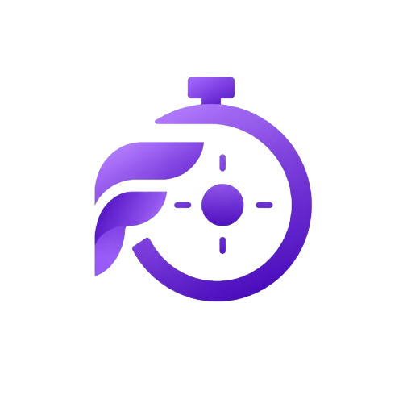

# FocusMaster

<div align="center">
  
  <h3>The Ultimate AI-Powered Productivity Workspace</h3>
  <p>A beautifully designed, unified dashboard engineered to maximize cognitive potential, maintain deep work flow states, and intelligently adapt to your study and work patterns.</p>
</div>

<p align="center">
  
  
  
  
  
</p>

## Key Features

### Intelligent AI Study Coach & Planner
- **Dynamic Study Planner**: Automatically generates weekly subject schedules based on your stream, exam dates, and available hours.
- **RAG Notes Assistant**: Upload your PDF study materials and chat instantly with an AI that retrieves precise answers directly from your notes.
- **Smart Nudges & Preparation Advice**: Daily AI-generated insights analyzing your focus history to give actionable productivity advice.
- **Floating AI Widget**: A premium, globally accessible AI chat assistant ready to provide coaching and context-aware feedback at any moment.

### Advanced Productivity Tools
- **Pomodoro Timer**: Customizable focus intervals, visual progress rings, and adaptive timer suggestions based on drop-off analysis.
- **Kanban Task Manager**: Drag-and-drop workflow tracking with custom tags, priority levels, and daily persistence.
- **Clock In/Out Ecosystem**: Comprehensive daily session tracking with rich, calendar-based activity logs.
- **Deep Analytics**: Interactive productivity heatmaps, focus trends, task completion rates, and gamified level progressions.

### Seamless Integrations
- **Spotify Premium Controller**: Manage your deep-work playlists and control playback directly from your dashboard without breaking focus.
- **Secure Authentication**: Robust JWT-based auth and integrated Google OAuth sign-in.
- **Admin Panel**: User role management (RBAC), system metrics, and audit logs.

## Tech Stack

| Domain | Technologies |
|---|---|
| **Frontend** | React 19, TypeScript, Tailwind CSS 4, Framer Motion, Zustand, Shadcn/ui, Vite |
| **Backend** | Node.js, Express 5, MongoDB (Mongoose), Google Generative AI (Gemini), Multer |
| **DevOps & Testing** | Vercel (CI/CD), Jest, Supertest, Vitest, Playwright (E2E) |

## Quick Start

### 1. Clone the repository
```bash
git clone https://github.com/codxbrexx/FocusMaster.git
cd FocusMaster
```

### 2. Configure Backend
Create a `.env` file in the `backend/` directory:
```env
PORT=5000
MONGO_URI=your_mongodb_connection_string
JWT_SECRET=your_super_secret_jwt_key
GOOGLE_CLIENT_ID=your_google_client_id
GOOGLE_CLIENT_SECRET=your_google_client_secret
SPOTIFY_CLIENT_ID=your_spotify_client_id
SPOTIFY_CLIENT_SECRET=your_spotify_client_secret
GEMINI_API_KEY=your_google_gemini_api_key
DEFAULT_LLM_MODEL=gemini-2.0-flash
```

```bash
cd backend
npm install
npm run dev
```

### 3. Configure Frontend
Create a `.env` file in the `frontend/` directory:
```env
VITE_API_URL=http://localhost:5000/api
VITE_GOOGLE_CLIENT_ID=your_google_client_id
```

```bash
cd frontend
npm install
npm run dev
```

## Documentation
Comprehensive architecture guides, API specifications, and development workflows can be found in the [`docs/`](./docs) directory.

---
<div align="center">
  <b>Designed & Developed by <a href="https://github.com/codxbrexx">@codxbrexx</a></b>
  <br />
  <i>Productivity Workspace | MIT License</i>
</div>
