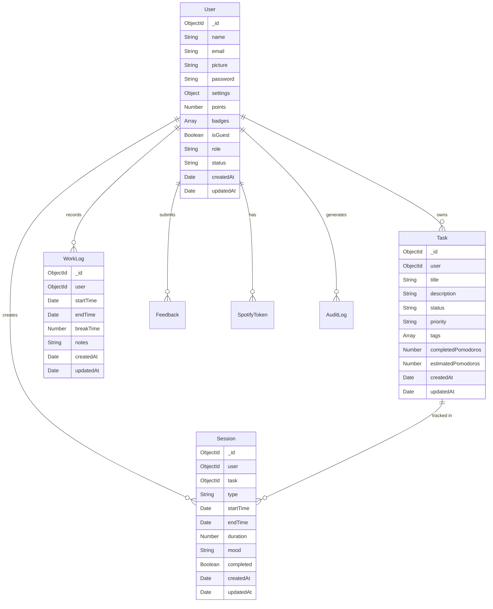

# Database Schema

FocusMaster uses MongoDB with Mongoose ODM. Below is the complete schema documentation.

## Collections Overview



---

## User Schema

**Collection:** `users`

### Fields

| Field | Type | Required | Default | Description |
|-------|------|----------|---------|-------------|
| `_id` | ObjectId | Auto | - | Unique identifier |
| `name` | String | ✅ | - | User's full name |
| `email` | String | ✅ | - | Unique email address |
| `picture` | String | ❌ | Default avatar | Profile picture URL |
| `password` | String | ✅ | - | Hashed password (bcrypt) |
| `settings` | Object | ❌ | See below | User preferences |
| `points` | Number | ❌ | 0 | Gamification points |
| `badges` | Array | ❌ | [] | Earned badges |
| `isGuest` | Boolean | ❌ | false | Guest account flag |
| `role` | String | ✅ | "user" | Role: user, admin |
| `status` | String | ❌ | "active" | Status: active, banned, suspended |
| `banReason` | String | ❌ | - | Reason for ban (hidden) |
| `emailOTP` | String | ❌ | - | Email verification OTP (hidden) |
| `emailOTPExpires` | Date | ❌ | - | OTP expiration (hidden) |
| `newEmail` | String | ❌ | - | Pending email change (hidden) |
| `createdAt` | Date | Auto | Now | Account creation timestamp |
| `updatedAt` | Date | Auto | Now | Last update timestamp |

### Settings Object

```javascript
{
  theme: { type: String, default: "light" },
  autoStartSession: { type: Boolean, default: false },
  autoStartBreak: { type: Boolean, default: false },
  motivationalQuotes: { type: Boolean, default: true },
  focusDuration: { type: Number, default: 25 },
  shortBreakDuration: { type: Number, default: 5 },
  longBreakDuration: { type: Number, default: 15 },
  dailyGoal: { type: Number, default: 8 },
  soundEnabled: { type: Boolean, default: true },
  strictMode: { type: Boolean, default: false }
}
```

### Methods

- `matchPassword(enteredPassword)` - Compare password with bcrypt
- Pre-save hook for password hashing

### Indexes

- `email` - Unique index
- `status` - Regular index for filtering

---

## Session Schema

**Collection:** `sessions`

### Fields

| Field | Type | Required | Default | Description |
|-------|------|----------|---------|-------------|
| `_id` | ObjectId | Auto | - | Unique identifier |
| `user` | ObjectId | ✅ | - | Reference to User |
| `task` | ObjectId | ❌ | - | Reference to Task |
| `type` | String | ✅ | - | focus, shortBreak, longBreak |
| `startTime` | Date | ✅ | - | Session start time |
| `endTime` | Date | ❌ | - | Session end time |
| `duration` | Number | ✅ | - | Duration in seconds |
| `mood` | String | ❌ | - | happy, neutral, sad, focused, distracted |
| `completed` | Boolean | ❌ | true | Session completion status |
| `createdAt` | Date | Auto | Now | Record creation timestamp |
| `updatedAt` | Date | Auto | Now | Last update timestamp |

### Relationships

- `user` → User (many-to-one)
- `task` → Task (many-to-one, optional)

---

## Task Schema

**Collection:** `tasks`

### Fields

| Field | Type | Required | Default | Description |
|-------|------|----------|---------|-------------|
| `_id` | ObjectId | Auto | - | Unique identifier |
| `user` | ObjectId | ✅ | - | Reference to User |
| `title` | String | ✅ | - | Task title |
| `description` | String | ❌ | - | Task description |
| `status` | String | ❌ | "todo" | todo, in-progress, done |
| `priority` | String | ❌ | "medium" | low, medium, high |
| `tags` | Array | ❌ | [] | Task tags/categories |
| `completedPomodoros` | Number | ❌ | 0 | Completed pomodoro count |
| `estimatedPomodoros` | Number | ❌ | - | Estimated pomodoros needed |
| `dueDate` | Date | ❌ | - | Task deadline |
| `createdAt` | Date | Auto | Now | Task creation timestamp |
| `updatedAt` | Date | Auto | Now | Last update timestamp |

---

## WorkLog Schema

**Collection:** `worklogs`

### Fields

| Field | Type | Required | Default | Description |
|-------|------|----------|---------|-------------|
| `_id` | ObjectId | Auto | - | Unique identifier |
| `user` | ObjectId | ✅ | - | Reference to User |
| `startTime` | Date | ✅ | - | Clock in time |
| `endTime` | Date | ❌ | - | Clock out time |
| `breakTime` | Number | ❌ | 0 | Break duration in seconds |
| `notes` | String | ❌ | - | Work log notes |
| `createdAt` | Date | Auto | Now | Record creation timestamp |
| `updatedAt` | Date | Auto | Now | Last update timestamp |

---

## SpotifyToken Schema

**Collection:** `spotifytokens`

### Fields

| Field | Type | Required | Default | Description |
|-------|------|----------|---------|-------------|
| `_id` | ObjectId | Auto | - | Unique identifier |
| `user` | ObjectId | ✅ | - | Reference to User |
| `accessToken` | String | ✅ | - | Spotify access token |
| `refreshToken` | String | ✅ | - | Spotify refresh token |
| `expiresAt` | Date | ✅ | - | Token expiration time |
| `createdAt` | Date | Auto | Now | Record creation timestamp |
| `updatedAt` | Date | Auto | Now | Last update timestamp |

---

## Feedback Schema

**Collection:** `feedbacks`

### Fields

| Field | Type | Required | Default | Description |
|-------|------|----------|---------|-------------|
| `_id` | ObjectId | Auto | - | Unique identifier |
| `user` | ObjectId | ✅ | - | Reference to User |
| `type` | String | ✅ | - | bug, feature, general |
| `category` | String | ❌ | - | Feedback category |
| `message` | String | ✅ | - | Feedback message |
| `status` | String | ❌ | "pending" | pending, reviewed, resolved |
| `createdAt` | Date | Auto | Now | Submission timestamp |
| `updatedAt` | Date | Auto | Now | Last update timestamp |

---

## AuditLog Schema

**Collection:** `auditlogs`

### Fields

| Field | Type | Required | Default | Description |
|-------|------|----------|---------|-------------|
| `_id` | ObjectId | Auto | - | Unique identifier |
| `admin` | ObjectId | ✅ | - | Reference to Admin User |
| `action` | String | ✅ | - | Action performed |
| `targetUser` | ObjectId | ❌ | - | Target user (if applicable) |
| `details` | Object | ❌ | - | Additional details |
| `ipAddress` | String | ❌ | - | IP address |
| `userAgent` | String | ❌ | - | User agent string |
| `createdAt` | Date | Auto | Now | Action timestamp |

---

## ErrorLog Schema

**Collection:** `errorlogs`

### Fields

| Field | Type | Required | Default | Description |
|-------|------|----------|---------|-------------|
| `_id` | ObjectId | Auto | - | Unique identifier |
| `user` | ObjectId | ❌ | - | Reference to User |
| `message` | String | ✅ | - | Error message |
| `stack` | String | ❌ | - | Error stack trace |
| `endpoint` | String | ❌ | - | API endpoint |
| `method` | String | ❌ | - | HTTP method |
| `severity` | String | ❌ | "error" | info, warning, error, critical |
| `createdAt` | Date | Auto | Now | Error timestamp |

---

## Data Relationships

### User → Sessions
- One user can have many sessions
- Sessions reference user via `user` field

### User → Tasks
- One user can have many tasks
- Tasks reference user via `user` field

### Task → Sessions
- One task can be tracked in many sessions
- Sessions optionally reference task via `task` field

### User → WorkLogs
- One user can have many work log entries
- Work logs reference user via `user` field

---

## Indexing Strategy

### Performance Indexes
```javascript
// Users
users.createIndex({ email: 1 }, { unique: true })
users.createIndex({ status: 1 })

// Sessions
sessions.createIndex({ user: 1, startTime: -1 })
sessions.createIndex({ type: 1 })

// Tasks
tasks.createIndex({ user: 1, status: 1 })
tasks.createIndex({ user: 1, createdAt: -1 })

// WorkLogs
worklogs.createIndex({ user: 1, startTime: -1 })
```

---

## Data Retention

- **Sessions**: Retained indefinitely
- **WorkLogs**: Retained indefinitely
- **AuditLogs**: Retained for 90 days
- **ErrorLogs**: Retained for 30 days
- **Guest Accounts**: Deleted after 30 days of inactivity
