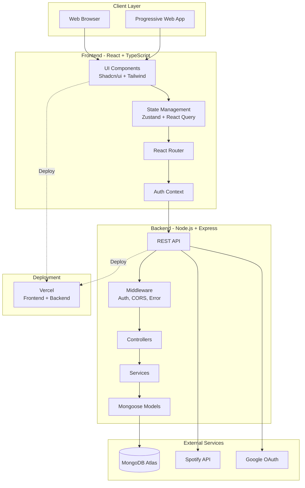
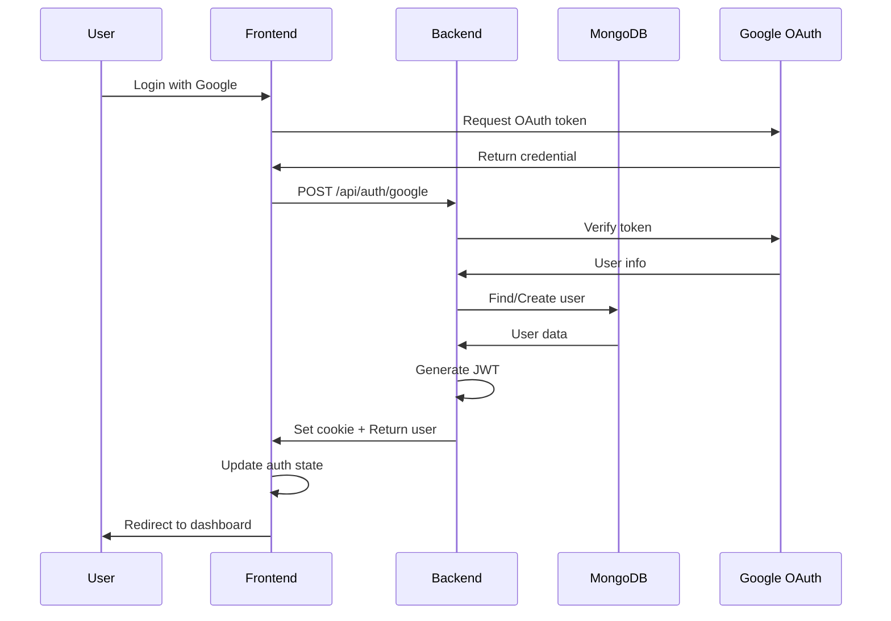
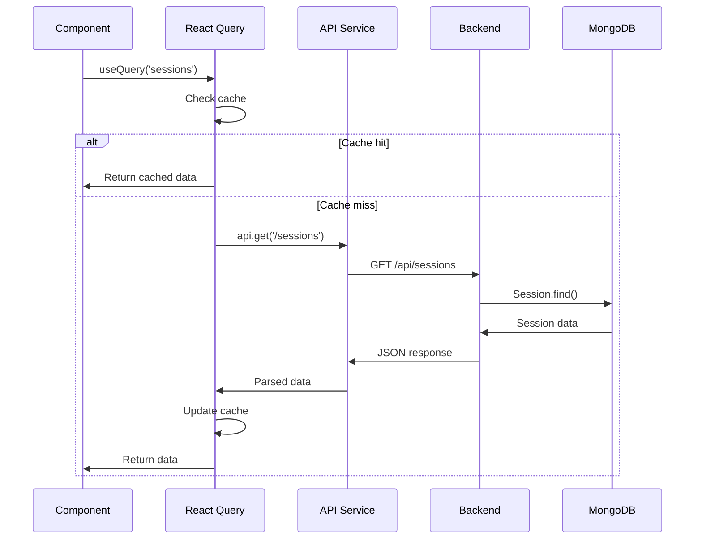
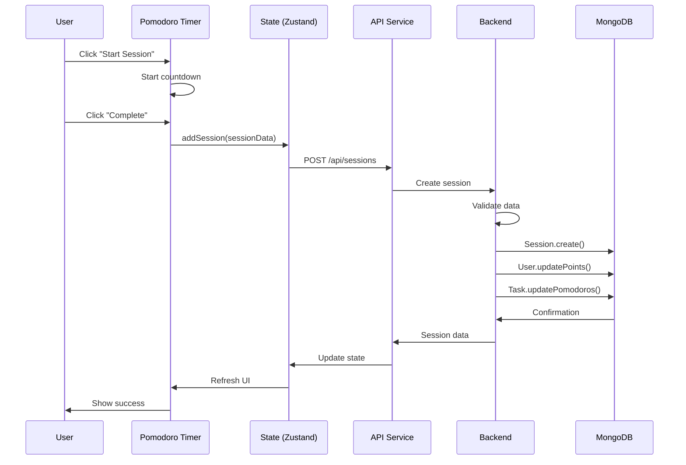

# System Architecture Overview

FocusMaster is built as a modern full-stack web application with a clear separation between frontend and backend.

## High-Level Architecture



---

## Architecture Principles

### 1. **Separation of Concerns**
- Frontend handles UI/UX and state management
- Backend handles business logic and data persistence
- Clear API boundaries between layers

### 2. **Modular Design**
- Component-based UI architecture
- Route-Controller-Service-Model pattern in backend
- Reusable utilities and helpers

### 3. **Security First**
- JWT authentication with HttpOnly cookies
- Role-based access control (RBAC)
- Input validation and sanitization
- CORS protection

### 4. **Performance Optimized**
- React Query for efficient data fetching and caching
- Lazy loading and code splitting
- Database indexing for fast queries
- CDN for static assets

### 5. **Scalability**
- Stateless API design
- Microservice-ready architecture
- Horizontal scaling capability

---

## Technology Stack

### Frontend
```
React 19.2.0         → UI framework
TypeScript 5.9       → Type safety
Vite 7.2.4           → Build tool & dev server
Tailwind CSS 4.1     → Styling framework
Shadcn/ui            → Component library
Zustand 5.0.9        → State management
React Query 5.90     → Server state management
React Router 7.10    → Client-side routing
Framer Motion 12.23  → Animations
Axios 1.13.2         → HTTP client
```

### Backend
```
Node.js 18+          → Runtime environment
Express 5.2.1        → Web framework
MongoDB 7.0          → Database
Mongoose 9.0         → ODM
JWT                  → Authentication
bcryptjs 3.0.3       → Password hashing
Google Auth Library  → OAuth integration
Axios                → External API calls
```

### DevOps & Deployment
```
Vercel               → Hosting platform
GitHub Actions       → CI/CD (future)
MongoDB Atlas        → Cloud database
ESLint               → Code linting
Prettier             → Code formatting
Vitest               → Testing framework
```

---

## Request Flow

### 1. User Authentication Flow



### 2. Data Fetching Flow



### 3. Session Creation Flow



---

## Directory Structure

### Backend Structure
```
backend/
├── src/
│   ├── admin/              # Admin panel logic
│   │   ├── controllers/    # Admin controllers
│   │   ├── middleware/     # Admin auth middleware
│   │   └── routes/         # Admin routes
│   ├── config/             # Configuration files
│   │   └── db.js           # MongoDB connection
│   ├── controllers/        # Route controllers
│   │   ├── authController.js
│   │   ├── sessionController.js
│   │   ├── taskController.js
│   │   └── ...
│   ├── middleware/         # Express middleware
│   │   ├── authMiddleware.js
│   │   └── errorMiddleware.js
│   ├── models/             # Mongoose schemas
│   │   ├── User.js
│   │   ├── Session.js
│   │   ├── Task.js
│   │   └── ...
│   ├── routes/             # API routes
│   │   ├── authRoutes.js
│   │   ├── sessionRoutes.js
│   │   ├── taskRoutes.js
│   │   └── ...
│   ├── services/           # Business logic
│   │   └── spotifyService.js
│   ├── utils/              # Utility functions
│   │   └── generateToken.js
│   ├── app.js              # Express app setup
│   └── server.js           # Server entry point
├── tests/                  # Backend tests
├── .env                    # Environment variables
└── package.json
```

### Frontend Structure
```
frontend/
├── public/                 # Static assets
├── src/
│   ├── components/         # React components
│   │   ├── ui/             # Shadcn UI components
│   │   ├── landing-page/   # Landing page components
│   │   ├── settings/       # Settings components
│   │   ├── Calendar.tsx
│   │   ├── GlobalTimer.tsx
│   │   ├── KanbanBoard.tsx
│   │   └── ...
│   ├── context/            # React Context providers
│   │   └── AuthContext.tsx
│   ├── hooks/              # Custom React hooks
│   ├── lib/                # Utility libraries
│   │   └── utils.ts
│   ├── pages/              # Page components
│   │   ├── Dashboard.tsx
│   │   ├── Pomodoro.tsx
│   │   ├── Analytics.tsx
│   │   └── ...
│   ├── services/           # API services
│   │   └── api.ts          # Axios instance
│   ├── store/              # Zustand stores
│   │   ├── useAuthStore.ts
│   │   ├── useHistoryStore.ts
│   │   ├── useTaskStore.ts
│   │   └── ...
│   ├── tests/              # Frontend tests
│   ├── App.tsx             # Root component
│   ├── main.tsx            # Entry point
│   └── index.css           # Global styles
├── .env                    # Environment variables
├── vite.config.ts          # Vite configuration
└── package.json
```

---

## Security Architecture

### Authentication Flow
1. User logs in → Backend validates credentials
2. Backend generates JWT token
3. Token stored in HttpOnly cookie
4. Frontend includes cookie in all requests
5. Backend middleware validates token
6. Request proceeds if valid

### Authorization Layers
- **Public routes**: No auth required (login, register)
- **Protected routes**: Requires valid JWT
- **Admin routes**: Requires admin role + valid JWT

### Security Measures
- ✅ Password hashing with bcryptjs
- ✅ JWT tokens with expiration
- ✅ HttpOnly cookies (XSS protection)
- ✅ CORS configuration
- ✅ Input validation
- ✅ Rate limiting (planned)
- ✅ SQL injection prevention (MongoDB/Mongoose)

---

## Data Flow Patterns

### State Management Strategy

**Local State** (useState)
- Component-specific UI state
- Form inputs
- Toggle states

**Global State** (Zustand)
- User authentication
- App-wide settings
- Cross-component data

**Server State** (React Query)
- API data
- Cached responses
- Background refetching

**URL State** (React Router)
- Pagination
- Filters
- Navigation

---

## Deployment Architecture

### Vercel Deployment
```
GitHub Repository
    ↓
Vercel CI/CD
    ↓
Build Process
    ├── Frontend: npm run build (Vite)
    └── Backend: No build needed (Node.js)
    ↓
Deployment
    ├── Frontend → Vercel Edge Network
    └── Backend → Vercel Serverless Functions
    ↓
Production
    ├── https://focus-master-tau.vercel.app
    └── MongoDB Atlas (Cloud Database)
```

### Environment Separation
- **Development**: localhost:5173 (frontend) + localhost:5000 (backend)
- **Production**: Vercel deployment with production MongoDB

---

## Future Architecture Improvements

### Planned Enhancements
- [ ] WebSocket support for real-time features
- [ ] Redis caching layer
- [ ] CDN for static assets
- [ ] Microservices architecture
- [ ] GraphQL API (optional)
- [ ] Server-side rendering (SSR)
- [ ] Progressive Web App (PWA) features
- [ ] Docker containerization
- [ ] Kubernetes orchestration

---

**Last Updated:** February 2026
